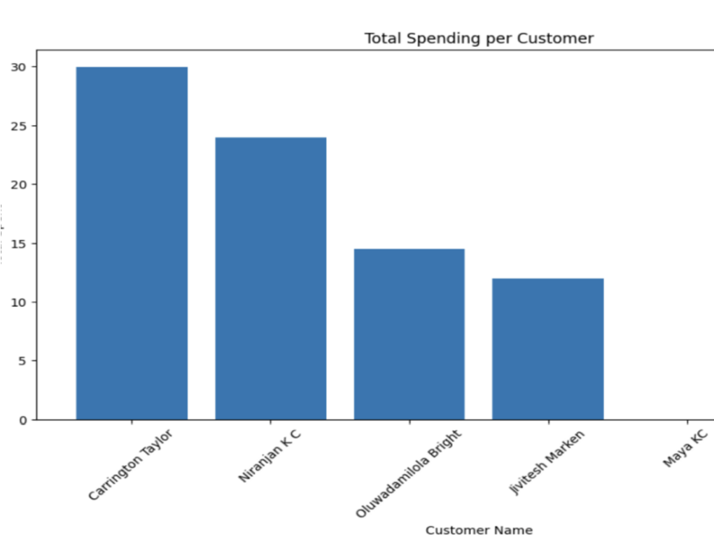
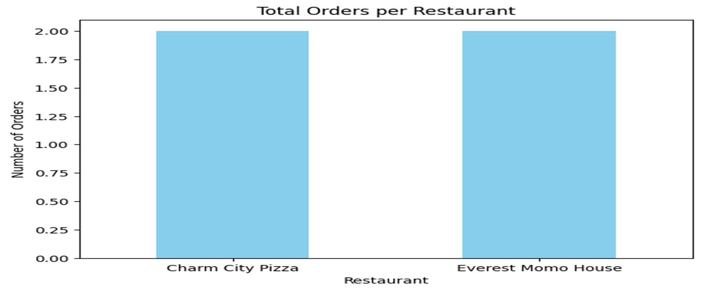
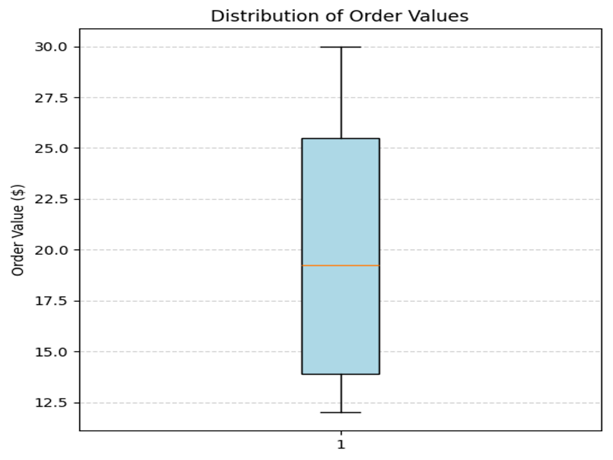

# Food Delivery Analytics Platform

This project demonstrates a complete data management and analytics system for a food delivery platform.
It simulates real-world applications such as Uber Eats or DoorDash by integrating database design, SQL analytics, and data visualization.

---

## Project Overview

The system manages key components of a food delivery platform:

* Customers
* Restaurants
* Menu Items
* Orders and Order Details
* Drivers
* Payments
* Reviews

The goal of this project is to design a structured database and generate meaningful business insights from transactional data.

---

## Technical Skills Applied

Programming
SQL | Python

Database Management
MySQL | Relational Database Design | Normalization (1NF–3NF)

Data Analysis
SQL Analytics | Aggregation | Data Interpretation

Data Visualization
Matplotlib | Pandas

---

## Key Features

* Designed an ERD with multiple entities and relationships
* Implemented relational schema using MySQL
* Applied normalization to ensure data integrity
* Created analytical SQL queries using joins, aggregations, and subqueries
* Developed reusable SQL views for reporting
* Implemented stored procedures, triggers, and transaction control
* Connected MySQL with Python (Colab) for data analysis
* Built visualizations to communicate insights

---

## SQL Analytics

The project includes analytical queries to answer business questions such as:

* Which restaurants generate the highest revenue
* Which customers spend the most
* How order values are distributed

Reusable views:

* Customer Order Summary
* Restaurant Performance

---

## Data Visualization

### Total Spending per Customer

This chart shows that a small group of customers contributes the highest share of total revenue, indicating high-value customers.

---

### Total Orders per Restaurant

Both restaurants receive a similar number of orders, indicating equal demand. Differences in revenue suggest variation in pricing or order values.

---

### Order Value Distribution (Boxplot)

The boxplot shows order values range between approximately $12 and $30 with a median around $19, indicating stable pricing and consistent customer behavior.

---

## Key Insights

* Some restaurants generate higher revenue despite similar order volumes
* A small number of customers contribute a large portion of total revenue
* Order values are consistent, indicating stable pricing behavior

---

## Tools & Technologies

* MySQL
* SQL (DDL, DML, Analytical Queries)
* Python
* Pandas
* Matplotlib
* Google Colab

---

## Author

- Niranjan K C  
- Information Technology (Data Management & Analytics)  
- Towson University  
- Graduation: May 2026  

